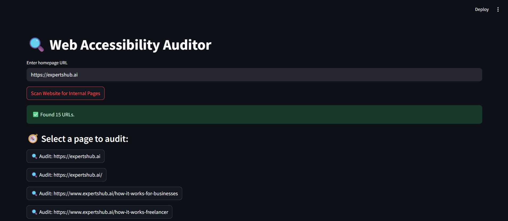
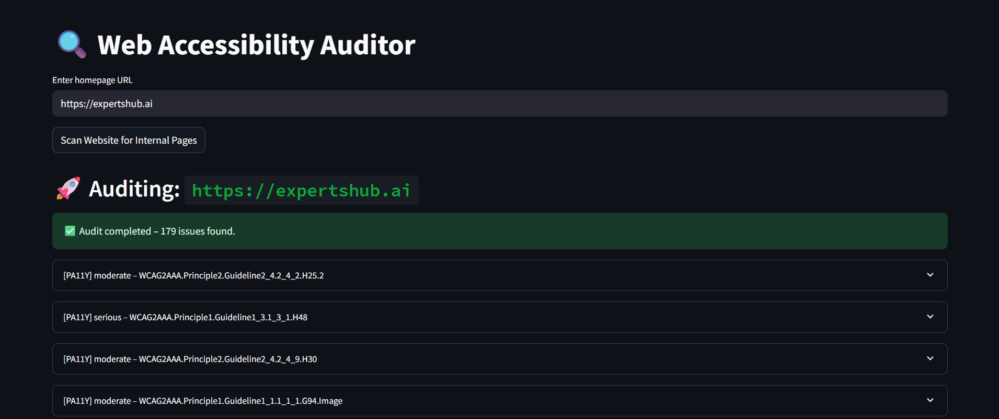
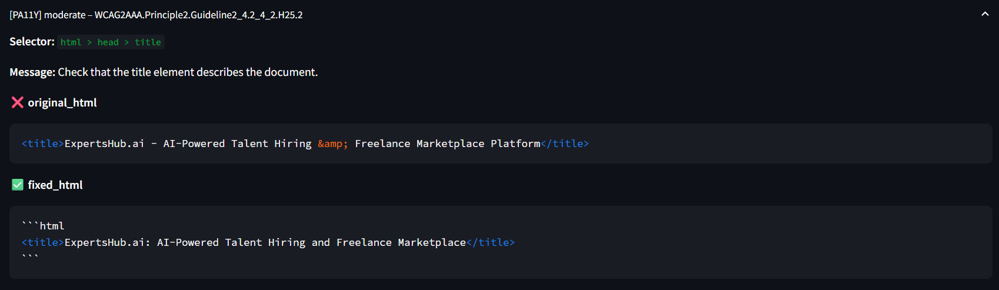

#  Web Accessibility Auditor

A powerful tool to **automatically audit websites for WCAG accessibility violations**, extract exact faulty HTML elements, and generate **AI-powered code fixes** using OpenAI or DeepSeek Coder (via Ollama).

---

##  What It Does

This application helps developers and QA engineers test websites for accessibility compliance. It:

- Crawls a website using `robots.txt` and/or `sitemap.xml`
- Finds **all internal URLs**
- Runs **WCAG audits** using Pa11y and Axe-core
- Uses **CSS selectors** to extract problematic HTML elements
- Suggests **AI-generated HTML fixes** using LLM:
  -  OpenAI (GPT-4o)
  -  DeepSeek coder model(used through Ollama)

---

---

## How It Works

### 1. 🕸️ Scan URLs

- Uses `/robots.txt` or `/sitemap.xml`
- Fallbacks to anchor-tag crawling
- Returns all internal pages (up to 5000)

### 2.  Select a Page

Choose a specific internal page from the scanned results.

### 3. Run Accessibility Audit

- Uses `pa11y` and `axe` to identify WCAG violations
- Displays:
  - Guideline code
  - Severity
  - Violation message
  - CSS selector

### 4.  Extract Violating HTML

- Queries HTML using `Playwright` and selector
- Extracts the exact DOM element's HTML

### 5.  Fix with LLM

Choose between:

- **OpenAI (GPT-4o)**
- **DeepSeek Codder model(used through Ollama)**
  

Each gives a fixed version of the HTML snippet, resolving the accessibility issue.

### 6. Export to CSV/JSON

---
